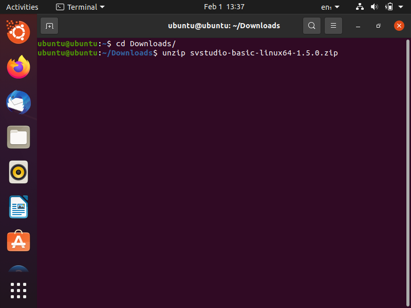
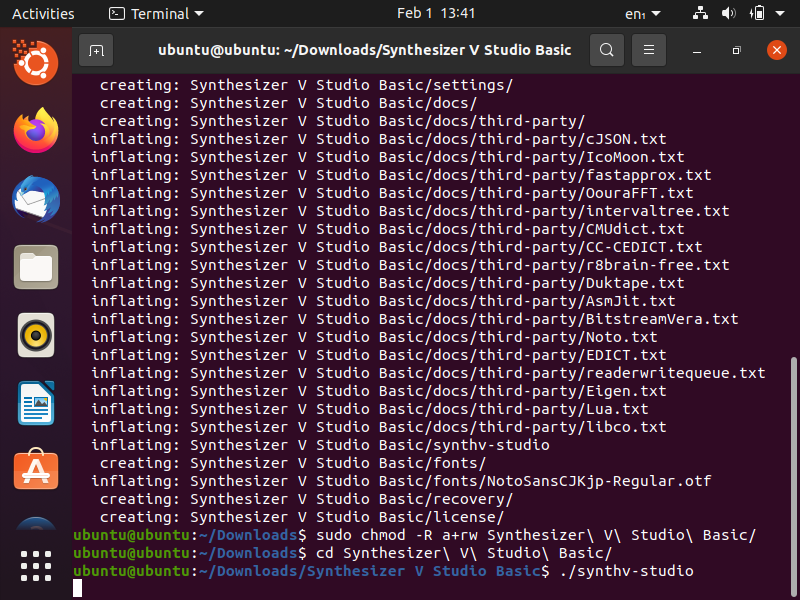
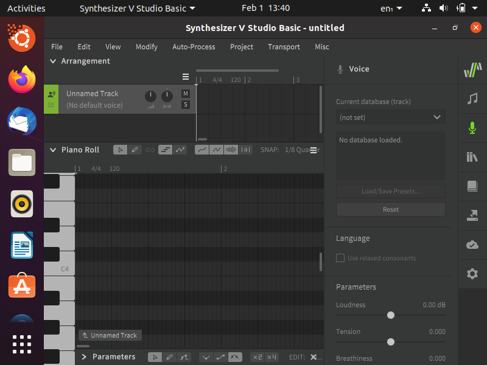
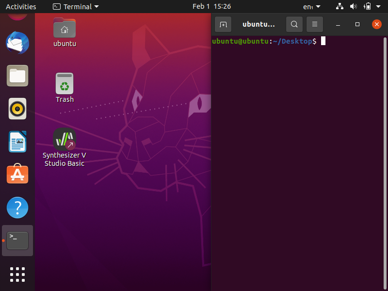

虽然知道没什么人用但是填个坑就对了（
<!-- more -->



请注意，只有部分发行版满足Synthesizer V __最新版__ 的最小运行要求 ~~(但官方似乎并没有给出详细的要求文档)~~

具体体现在：`GLIBC` 需要 `GLIBC_2.30` 版本及以上（图在[下文](#部分运行失败的解决方案)）

我的备用机使用的是 __Deepin 20.4__ ，它只有 `GLIBC_2.29`，因而只能用1.2.4的旧版（估计也没人愿意使用这个很多声库都不支持的版本了）

所以本文将在 __Ubuntu-20.04.3-desktop (amd64, LIVE)__ 的虚拟机上再现安装过程



## 0x00 下载安装包（.zip）
### Basic版本
- [SynthV官网入口](https://dreamtonics.com/synthesizerv/#syn-studio) 或 [D社资源站（官方）](https://resource.dreamtonics.com/download/Synthesizer%20V%20Studio%20Basic/)
- [SVR2Doc站（国内）](https://synthesizer-v-r2-docs.vercel.app/docs/download/editor)（感谢磷元素佬和时忽Entropy提供的Docs站和下载服务！！！佬佬佬%%%）
### Pro版本/Basic版本
- Pro版本需要购买后发送下载链接
- [平行四界](https://item.taobao.com/item.htm?spm=a1z10.5-c-s.w4002-15324549429.10.78447274mK0guB&id=622045467110)提供的是1.4.0c的版本，需要下载后手动更新到最新版
- [AHS](https://www.ah-soft.net/shopdetail/000000001193/ct120/page1/order/)和[AniCUTE](https://www.anicute.com/product/d3c64666-9436-49ac-acef-196f7bf3ffaa)未知

*P.S. 本文以Basic版本1.5.0为例，Pro版本应该差不多（吧？）*

## 0x01 解压和运行

### 打开终端，cd到你的下载目录并解压

```
cd Downloads/
unzip svstudio-basic-linux64-1.5.0.zip

```




部分发行版可能需要加权

```
sudo chmod -R a+rw "Synthesizer V Studio Basic"
```
*-R：递归设置每一个子文件*


### 运行

```
cd "Synthesizer V Studio Basic"
./synthv-studio
```







#### 部分运行失败的解决方案

1.提示找不到共享库


可能是没有安装curl
终端输入以下内容即可
```
sudo apt-get update
sudo apt-get -f install
sudo apt-get install libcurl4-openssl-dev
sudo apt-get install curl
```

2.提示内核/glibc等版本过低


**换个系统/发行版** 吧！可以去百度搜索如何更新，但是涉及到这一块升级要谨慎，很有可能一个差错（甚至没有差错）就再也无法启动了。（狗头）



## 0x02 打包与封装图标

由于SV Studio在linux是解压直接运行式的（类似于Firefox），我们最好把它打包到系统软件目录并且发送一个图标到桌面

### 移动到/usr/local并改名

```
sudo mv "Synthesizer V Studio Basic"/ /usr/local/svstudio/
```

### 创建图标

下载图标文件


```
sudo wget -P /usr/local/svstudio https://hezebang.github.io/img/SVAlive.png
```



P.S. 你甚至可以下载隐卫麻麻制作的镀金图片！只需要下载https://hezebang.github.io/img/SVGolden.png 即可~记住后面的文件名也要换哦（麻麻狗头）

**图标资源来自SV官群,感谢麻麻制作的图标！**



在终端中输入以下命令新建启动菜单图标

```
sudo nano /usr/share/applications/svstudio.desktop
```

进入到nano编辑器，粘贴以下内容

```
[Desktop Entry]
Comment=a high-quality singing synthesis software
Exec=/usr/local/svstudio/synthv-studio
Icon=/usr/local/svstudio/SVAlive.png
MimeType=application/tup;
Name=Synthesizer V Studio Basic
Terminal=false
Type=Application;Audio;
```

> Pro版本把`Name`改为`……Pro`即可，图标可以自定义

按`Ctrl` + `X`退出，是否保存按 `y` 确认

### 再复制到桌面，加权

```
cp /usr/share/applications/svstudio.desktop ~/Desktop/
chmod +x ~/Desktop/svstudio.desktop
```

## 0x03 大功告成


